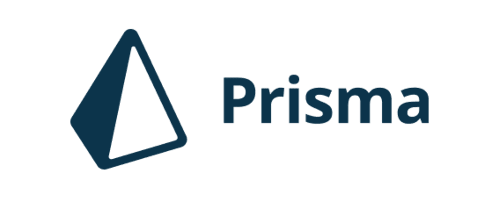

<div align="middle">
  
  
  
</div>
<br>
<br>


## 1. Installing project dependencies

```bash
$ yarn
```

## 2. Setting up the database

2.1. Create and run the database with docker-compose

```bash
$ docker-compose up -d
```
2.2. Run migrations and seed to prepare the database

```bash
$ npx prisma migrate reset
```
## 3. Running the app

3.1. Build the app

```bash
$ yarn build
```

3.2. Run the app

```bash
$ yarn start:prod
```

## 4. Using the app
Access the swagger ui interface and interact with the API endpoints through the below url:

```
http://localhost:8080/api
```

## 5. Running the unit tests

```bash
$ yarn test
```
